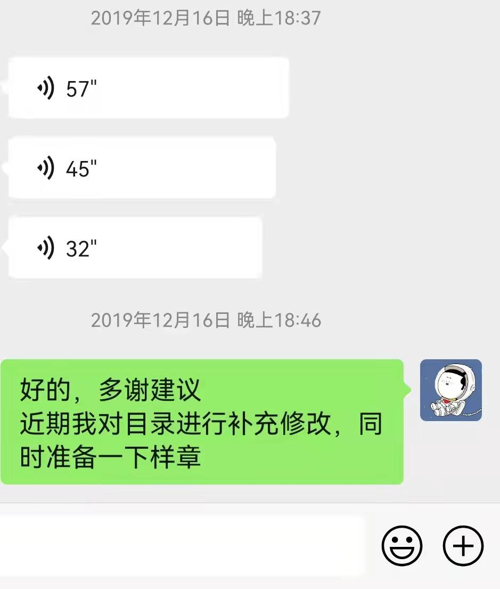

本资源为《PyTorch实用教程》（第二版），动笔时间为2021年12月16日，什么时候能完结，并不知道

为什么会不是写完再发布？因为担心再不迈出第一步，这本书就会难产了。其实，想写这本书已经很久了，至少2年多了吧（见下图）

总由于各种原因，迟迟没有开始动笔，索性，采用github在线更新的方式，和各位朋友提前见面吧，你们的反馈是我最大的动力。

第一版在这里：<a href="https://github.com/TingsongYu/PyTorch_Tutorial/">PyTorch模型训练实用教程</a> 

第二版在这里：<a href="https://tingsongyu.github.io/PyTorch-Tutorial-2nd/">PyTorch实用教程第二版</a> 

有缘看到此repo的同学，请给个**star**，你们的反馈是我最大的动力，争取早日完结！

**停更记录：**

| 日期          | 进度      | 停更原因                                                     | 停更时间                     |
| ------------- | --------- | ------------------------------------------------------------ | ---------------------------- |
| 2022年1月下旬 | 完成至3.2 | 工作中有个“头疼”的项目                                       | 2022年1月下旬至2022年4月下旬 |
| 2022年7月下旬 | 完成至7.7 | 项目多了，新人多了，非公司外的事情多了。 预计要到11月可以继续 |                              |

