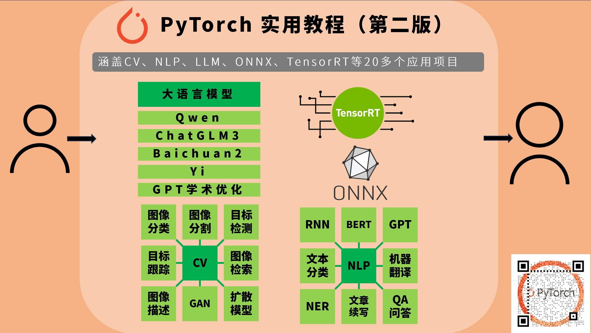

# PyTorch 实用教程（第二版）

时隔5年，历时4年，耗时2年的《PyTorch实用教程》（第二版）完成了。在第一版的精华之上，增加了丰富详实的**深度学习应用案例**和**推理部署框架**，使本书更系统性的涵盖深度学习工程师所涉及的知识面。如人工智能技术发展一浪接一浪，《Pytorch实用教程》（第二版）不是结束，而是再次扬帆起航，开启新的技术、新的领域、新的篇章，希望未来能继续与大家一起在人工智能技术里学习、进步。

📚 在线阅读（**开源免费**）：[《PyTorch实用教程》（第二版）](https://tingsongyu.github.io/PyTorch-Tutorial-2nd/)

🖥️ 配套代码（**开源免费**）：[《PyTorch实用教程》（第二版）](https://github.com/TingsongYu/PyTorch-Tutorial-2nd)

📢📢📢：请**点个Star**，予以鼓励！

---

本项目已被 HelloGitHub 社区收录，已加入 HelloGitHub 徽章计划

# 目录

- [本书内容](#本书内容)
  - [上篇-PyTorch基础](#上篇)
  - [中篇-产业应用](#中篇)
  - [下篇-推理部署](#下篇)
- [本书亮点](#本书亮点)

# 本书内容

本书以基础概念为基石，计算机视觉、自然语言处理和大语言模型为核心，推理部署框架为桥梁，皆在为读者提供面向项目落地的代码工程与理论讲解。本书整体分三部分，上篇：入门，中篇：应用，下篇：落地。

## 上篇

PyTorch基础。针对刚入门、非科班、本科生，提供PyTorch介绍，讲解开发环境的搭建，介绍PyTorch的数据、模型、优化、可视化等核心模块，最后利用所讲解的PyTorch知识点构建一套自己的代码结构，为后续的应用打下基础。

## 中篇

产业应用。经过上篇，磨了一把好刀，接下来就用它在各领域上大显身手。将会讲解三个主题，分别是计算机视觉（Computer Vision）、自然语言处理（Natural Language Processing）和大语言模型（Large Language Model）。

-

在CV章节，包括主流的任务，有**图像分类、图像分割、目标检测、目标跟踪、GAN生成、Diffusion生成、图像描述和图像检索**八大任务。

---

-

在NLP章节，包括RNN、LSTM、Transformer、BERT和GPT模型详解与应用，应用的任务有**文本分类、机器翻译、命名体识别、QA问答和文章生成**五大任务。

---

-

在LLM章节，包括4个LLM部署与代码分析和一个LLM行业应用——**GPT Academic（GPT 学术优化）**，LLM包括国内开源的四大主流模型，**Qwen、ChatGLM、Baichuan和Yi**。

## 下篇

工业落地。有了工具，有了场景，接下来就要让它产生价值，变成可用的、好用的算法服务。因此，从pytorch这样一个训练框架、重框架中剥离出来进行部署、加速、量化是常见的方法。本章将介绍**ONNX和TensorRT**的原理与使用，同时借助TensorRT详细分析模型量化概念、**PTQ和QAT量化**实战与原理。

相信经过上、中、下篇的学习，可以帮助入门的同学少走很多弯路，快速掌握PyTorch，具备独当一面的能力，能依据实际场景选择算法模型，可以将模型部署应用，形成闭环，全流程打通。

# **本书亮点**

- 结构清晰：全书分为三部分：上篇（入门）、中篇（应用）、下篇（落地），逐步引导读者深入学习。

- 理论与实践结合：不仅提供理论讲解，还通过丰富的项目案例，让读者能够将理论应用于实践。

- 实战案例丰富：提供了计算机视觉、自然语言处理和大语言模型等多个领域的实战案例。

- 系统性覆盖：涵盖PyTorch基础、计算机视觉基础任务、自然语言处理基础任务、大语言模型基础、推理部署框架。

- 适用性广：适合AI自学者、AI产品经理、在校学生以及跨领域人士阅读，满足不同背景和需求的读者。

    <picture>
    <source media="(prefers-color-scheme: dark)" srcset="https://api.star-history.com/svg?repos=TingsongYu/PyTorch-Tutorial-2nd&type=Date&theme=dark" />
    <source media="(prefers-color-scheme: light)" srcset="https://api.star-history.com/svg?repos=TingsongYu/PyTorch-Tutorial-2nd&type=Date" />
    
  </picture></a>

# 读者交流

为增强读者阅读氛围，提供交流途径，特地建立了QQ交流群。

为保证群内交流质量，入群需要密码，密码获取，请查看[代码](https://github.com/TingsongYu/PyTorch_Tutorial/blob/master/Code/4_viewer/5_Show_ConfMat.py)

近期会在群内分享最新技术文章，包括CV项目实战，LLM推理部署，RAG系统等前沿科技，欢迎加入技术交流。

一群：671103375 (已满)

 二群：773031536 (已满）

 三群：514974779 (已满）

 四群：854620826

# 开源协议

本作品采用[知识共享署名-非商业性使用 4.0 国际许可协议](https://creativecommons.org/licenses/by-nc/4.0/)进行许可。

# 附录

~~**停更记录：**~~

| 日期              | 进度           | 停更原因                                                     | 停更时间                         |
| ----------------- | -------------- | ------------------------------------------------------------ | -------------------------------- |
| ~~2022年1月下旬~~ | ~~完成至3.2~~  | ~~工作中有个“头疼”的项目~~                                   | ~~2022年1月下旬至2022年4月下旬~~ |
| ~~2022年7月下旬~~ | ~~完成至7.7~~  | ~~项目多了，新人多了，非公司外的事情多了。 预计要到11月可以继续~~ | ~~2022年7月下旬至2023年3月上旬~~ |
| ~~2023年7月上旬~~ | ~~完成至11.3~~ | ~~小情人诞生，精力耗尽...~~                                  | ~~2022年6月中旬至2023年1月中旬~~ |

