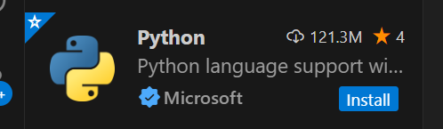
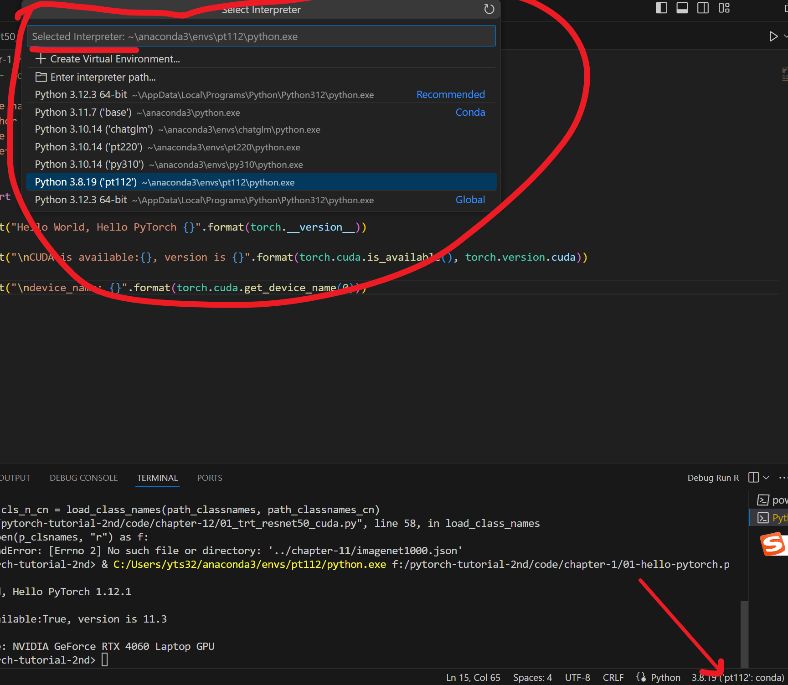

# 1.3 环境配置之IDE——PyCharm&VS Code

## Pycharm——强大的python IDE

Pycharm——强大的python IDE，拥有调试、语法高亮、Project管理、代码跳转、智能提示、版本控制等功能。是

Pycharm有社区版和专业版区分，社区版为免费的，专业版需要付费。

## Pycharm 社区版 VS 专业版

由于专业版需要一定的费用，对于普通学习者来说，若不需要特殊功能的话，社区版也是足够的。

专业版和社区版在功能上的一些主要区别如下：

|       功能分类       |                PyCharm专业版                 |          PyCharm社区版           |
| :------------------: | :------------------------------------------: | :------------------------------: |
|     **基础功能**     |                  - 代码编辑                  |            - 代码编辑            |
|                      |                  - 语法高亮                  |            - 语法高亮            |
|                      |                  - 代码提示                  |            - 代码提示            |
|                      |                 - 代码格式化                 |           - 代码格式化           |
|     **版本控制**     | - Mercurial, Subversion, Git, Perforce等支持 | - Mercurial, Subversion, Git支持 |
|     **代码分析**     |             - Python代码质量分析             |          - 基础代码分析          |
|     **代码重构**     |      - 重命名、提取方法/超类等重构功能       |         - 有限的重构功能         |
|      **调试器**      | - 强大的调试器，支持断点、步进、多画面视图等 |         - 基本的调试功能         |
|   **Web开发支持**    |         - Django, Flask等Web框架支持         |             - 不支持             |
| **数据库与SQL支持**  |          - 支持多种数据库与SQL查询           |             - 不支持             |
|   **科学计算工具**   |        - 支持NumPy, SciPy等科学计算库        |             - 不支持             |
|     **远程开发**     |         - 支持远程解释器、部署和调试         |             - 不支持             |
| **用户界面与自定义** |            - 高度可定制的用户界面            |        - 有限的自定义选项        |
|     **插件支持**     |           - 支持大量插件，扩展性强           |          - 支持有限插件          |
|    **许可与费用**    |             - 商业许可，需要付费             |    - 免费，但仅限于非商业用途    |

## Pycharm 的安装

这里我采用的是pycharm.2019专业版，用于演示。

1. 官网下载安装包 https://www.jetbrains.com/pycharm/
2. 运行pycharm-professional-2019.2.exe
3. 选择路径，勾选Add launchers dir to the PATH，等待安装完成

 激活部分：略。

这里主要讲如何创建项目，以及关联前面创建的虚拟环境pytorch_1.10_gpu。 打开pycharm，左上角的File可选择New，或者Open，如果已经有一个文件夹下有相关.py代码，那么就用Open对应的文件夹即可。这里假设已经存在pytorch-tutorial-2nd文件夹，找到它，Open即可。

我们找到pytorch-tutorial-2nd\code\chapter-1\01-hello-pytorch.py，发现import torch下面有个红色波浪线，鼠标放上去会提示“No Module named torch"，表明当前环境里并没有torch这个工具包。可好像我们并没有为当前.py文件设定好用哪个一解释器不是？所以我们先将当前项目pytorch-tutorial-2nd的虚拟环境设置为刚刚创建好的pytorch_1.10_gpu，然后再在pytorch_1.10_gpu里安装上pytorch即可。

左上角File--> Settings-->Project:pytorch-tutorial-2nd-->Project Interpreter， 然后如下图找到对应的python.exe，之后选中，点击OK,再次点击OK。就完成了虚拟环境与项目的关联，接着就可以安装pytorch了。


到这里，大家可以尝试运行 pytorch-tutorial-2nd\code\chapter-1\01-hello-pytorch.py，会提示

```
D:\Anaconda_data\envs\pytorch_1.10_gpu\python.exe E:/pytorch-tutorial-2nd/code/chapter-1/01-hello-pytorch.py
Traceback (most recent call last):
  File "E:/pytorch-tutorial-2nd/code/chapter-1/01-hello-pytorch.py", line 9, in <module>
    import torch
ModuleNotFoundError: No module named 'torch'

Process finished with exit code 1
```

这里是完整的Pycharm控制台信息，我们可以看到第一行先是解释器（即对应了我们创建的虚拟环境），然后是执行的.py文件，接着是报错信息，提示没有torch这个module，下一小节我们来就来安装这个module。

## Pycharm 拓展

pycharm是很好用的IDE，这里面提供很多快捷键，希望大家可以熟悉使用这些快捷键，例如常用的

* 批量注释：Ctrl + /

* 快速查看文档：Ctrl + q

* 搜索：Ctrl+f

* 运行：Shift + F10

* Tab / Shift + Tab 缩进、不缩进当前行

* Ctrl + D 复制选定的区域或行

* Ctrl + Y  删除选定的行

  更多功能推荐大家自行了解一下pycharm的基础使用，相信它一定是你的高效生产力。

  推荐pycharm也有一些文档教程：
  
  - [pycharm官方文档](https://www.jetbrains.com/help/pycharm/getting-started.html)
  
  - [《pycharm 中文指南》](https://pycharm.iswbm.com/)
  
  

## VS Code 简介

Visual Studio Code 是微软推出的独立源代码编辑器，可在 Windows、macOS 和 Linux 上运行，是 JavaScript 和 Web 开发人员的最佳选择，具有几乎可支持任何编程语言的扩展。其轻量的特点，受到广大开发者的喜爱，这里介绍如何在VS Code中配置python开发环境。

提到Visual Studio Code，大部分人都会联想到Visual Studio，但两者是完全不同的概念。

- Visual Studio：适用于 Windows 上 .NET 和 C++ 开发人员的最全面 IDE。 完整打包了一系列丰富的工具和功能，可提升和增强软件开发的每个阶段。
- Visual Studio Code：在 Windows、macOS 和 Linux 上运行的独立源代码编辑器。 JavaScript 和 Web 开发人员的最佳选择，具有几乎可支持任何编程语言的扩展。

从官网定义就知道，VS是IDE， VS Code是代码编辑器，下面进行VS Code安装、配置python开发环境。

## VS Code下载安装

VS Code下载安装非常简单，通过官网下载安装包：https://visualstudio.microsoft.com/zh-hans/

双击一路安装，在“选择附加任务”当中，建议把“**添加到 PATH(重启后生效)**”勾选上。

## VS Code Python环境配置

### 插件1 - Python

VS Code强大之处在于有许多插件，在这里python环境也需要安装一些插件，首先需要安装的插件是“Python”。
在IDE左侧的Extensions菜单中（Ctrl+Shift+X），输入python，搜索到Python插件，点击Install



安装好之后，点击右下角，选择解释器。




接着就可以右键对应的代码文件，Run Python -> Run Python File in Terminal，即可获得如下提示

第一行表示选择了解释器C:/Users/yts32/anaconda3/envs/pt112/python.exe，运行代码 f:/pytorch-tutorial-2nd/code/chapter-1/01-hello-pytorch.py。

```markdown
PS F:\pytorch-tutorial-2nd> & C:/Users/yts32/anaconda3/envs/pt112/python.exe f:/pytorch-tutorial-2nd/code/chapter-1/01-hello-pytorch.py
Hello World, Hello PyTorch 1.12.1

CUDA is available:True, version is 11.3

device_name: NVIDIA GeForce RTX 4060 Laptop GPU
```


### **插件2 - Python Pylance**

Pylance是强大的Python静态类型检查器，提供更精确的自动补全和错误检查。

### **插件3 - autoDocstring**

autoDocstring是函数自动注释模板生成插件， 在函数下输入"""回车，即可得到函数的注释模板，例如：

```python
    def test(a: str):
        """_summary_

        Args:
            a (str): _description_

        Returns:
            _type_: _description_
        """
        print(a)   
```

其他功能：

1. 自动生成文档字符串：快速生成可以逐个Tab键完成的文档字符串片段。
2. 支持多种文档字符串格式：用户可以选择不同格式的文档字符串，如Google、Sphinx、Numpy、docBlockr、one-line-sphinx和PEP257。
3. 类型推断：根据PEP484类型提示、默认值和变量名推断参数类型。
4. 支持参数和关键字参数：插件支持args、kwargs、装饰器、错误和参数类型的自动填充。
5. 自定义文档字符串模板：支持自定义模板，使用mustache.js模板引擎。

### **插件4 - Python Indent**

Python Indent是一个改进Python自动缩进的工具。这个插件通过解析用户编写的Python代码，自动确定每一行代码应该缩进的程度，主要功能和特点：

1. 自动缩进：按下Enter键时，插件会解析光标位置的Python文件并确定下一行（或两行，如果是悬挂缩进）应该缩进多少，以及附近的行应该如何取消缩进。
2. 括号配对缩进：当光标位于一个开放的括号（[({）和它的闭合括号对（相应的]})）之间时，插件会保持后续行的缩进正好在它被打开的位置的右侧。
3. 悬挂缩进：当用户打开一个括号但尚未插入任何内容时，按下Enter键将创建一个悬挂缩进，与VS Code的基本行为相匹配。
4. 关键字缩进：某些Python关键字（return, pass, break, continue, raise）暗示了特定的缩进行为。例如，如果有return语句，则下一行可以取消缩进，因为同一代码块中不能跟随任何语句。
5. 注释扩展：如果用户在注释中间按下Enter键，那么下一行将自动成为注释。

VS Code 整体组件轻便，简洁，适合中高级玩家进行高自由度的插件选择，打造适合自己的IDE，对于要求不高且无需要高级自定义功能，pycharm是不错的选择。

## 小结

pycharm和VS Code都是强大的IDE，前者适合“懒人”用户，开箱即用，后者适合喜欢DIY的开发者。这里个人建议入门者使用pycharm的社区版，方便快捷无烦恼的用上IDE。


