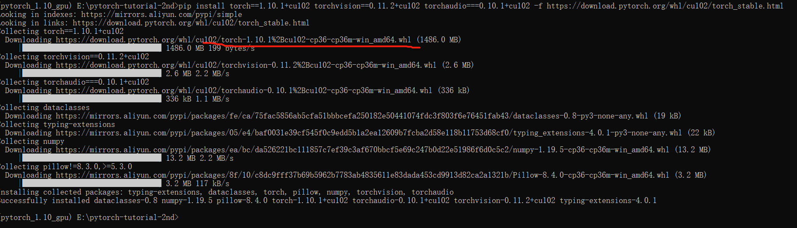

# 1.5 环境配置之PyTorch系列包

虚拟环境，Pycharm，CUDA，cuDNN均已准备好，现在终于可以安装PyTorch了，加油，就快成功啦。

现在，通过命令窗口，进入（激活）虚拟环境

```
E:\pytorch-tutorial-2nd>conda activate pytorch_1.10_gpu

(pytorch_1.10_gpu) E:\pytorch-tutorial-2nd>
```

可通过以下命令安装

```
pip3 install torch==1.10.1+cu102 torchvision==0.11.2+cu102 torchaudio===0.10.1+cu102 -f https://download.pytorch.org/whl/cu102/torch_stable.html
```



可以看到通过pip安装，也是下载我们提到的神奇网站里的whl文件，这时大家可以根据自己的网速决定是采用pip还是自行下载的方法。

如果网速不好的话，推荐通过神奇的网站——https://download.pytorch.org/whl/torch 搜索对应的whl进行下载。然后pip install ***.whl就行。

对于pip，建议大家**添加镜像源**。例如，清华镜像源或者中科大镜像源，这样安装python工具包的下载速度会快很多，请自行百度如何添加清华镜像源。


安装完毕，再回到pycharm，运行 pytorch-tutorial-2nd\code\chapter-1\01-hello-pytorch.py，可以看到

```
D:\Anaconda_data\envs\pytorch_1.10_gpu\python.exe E:/pytorch-tutorial-2nd/code/chapter-1/01-hello-pytorch.py
Hello World, Hello PyTorch 1.10.1+cu102

CUDA is available:True, version is 10.2

device_name: NVIDIA GeForce GTX 1660 Ti with Max-Q Design

Process finished with exit code 0
```

表示pytorch环境安装完毕，此时我们也可以再次打开pycharm的解释器配置，可以看到当前的解释器（虚拟环境）下，拥有的相关工具包，这个界面也是后续大家检查当前环境工具包版本常用的工具，请收藏。


