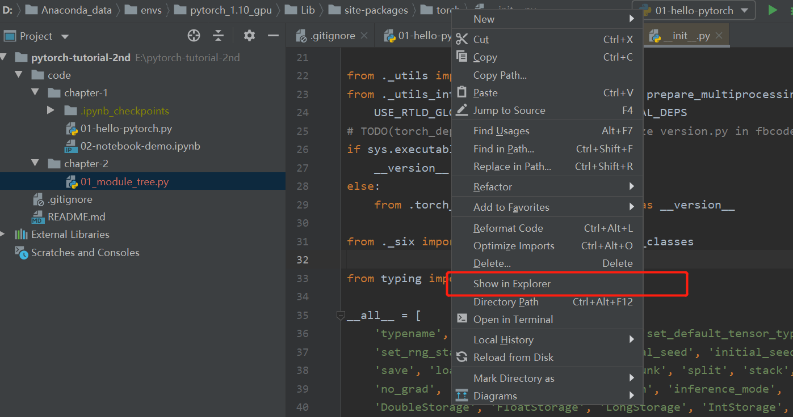
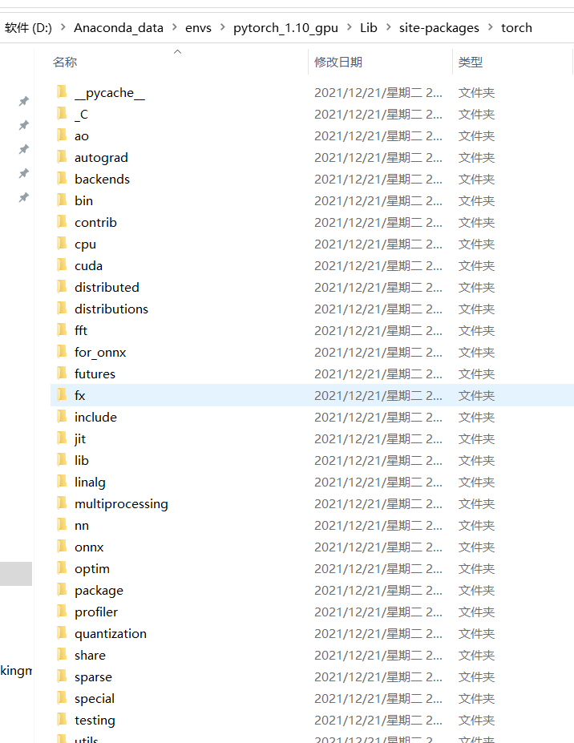

# 2.1 PyTorch 模块结构

上一章安装好的PyTorch是一个庞大的python库，里边包含几十个模块，这一小节就来了解都有哪些模块，每个模块代码在哪里，对应文档在哪里。从而帮助大家具象化PyTorch，清楚地知道所用的PyTorch函数、模块都在哪里，是如何调用的。

## 你的代码在哪？

很多朋友应该都用过pip/conda install 进行一键安装，但你的工具库代码装到哪里并不清楚。使用的时候也知道import ***，但具体引用的功能函数又是如何实现的，是模糊的。

为了让大家知道自己调用的是什么，我们先来看你安装的pytorch在哪里。上一章案例中，我们装的pytorch在：D:\Anaconda_data\envs\pytorch_1.10_gpu\Lib\site-packages\torch

如果pycharm中配置好了虚拟环境，大家也可以通过pycharm的快捷键，快速定位到这个文件夹。方法是，找到import torch这一行代码，按住Ctrl键，鼠标左键单击torch，就可以跳转到D:\Anaconda_data\envs\pytorch_1.10_gpu\Lib\site-packages\torch\__init__.py 文件。






可以看到torch文件夹中有一系列子文件夹，我们平时常用的函数都藏在这里面了，下面挑些重点注意介绍。

### \__pycache__

该文件夹存放python解释器生成的字节码，后缀通常为pyc/pyo。其目的是利用空间换时间，对应的模块直接读取pyc文件，而不需再次将.py语言转换为字节码的过程，从此节省了时间。

从文件夹名称可知，它是一个cache，缓存，如果需要，我们当然可以删掉它。更多关于pycache的内容，建议额外阅读：https://www.python.org/dev/peps/pep-3147/#proposal

### _C

从文件夹名称就知道它和C语言有关，其实它是辅助C语言代码调用的一个模块，该文件夹里存放了一系列pyi文件，pyi文件是python用来校验数据类型的，如果调用数据类型不规范，会报错。更多pyi知识，请查阅[PEP 8](https://www.python.org/dev/peps/pep-0008/) -->.pyi files that are read by the type checker in preference of the corresponding .py files.

**PyTorch的底层计算代码采用的是C++语言编写，并封装成库，供pytorch的python语言进行调用**。这点非常重要，后续我们会发现一些pytorch函数无法跳转到具体实现，这是因为具体的实现通过C++语言，我们无法在Pycharm中跳转查看。

### include

上面讲到pytorch许多底层运算用的是C++代码，那么C++代码在哪里呢？ 它们在[这里](https://github.com/pytorch/pytorch/tree/master/torch/csrc),在torch/csrc文件夹下可以看到各个.h/.hpp文件，而在python库中，只包含头文件，这些头文件就在include文件夹下。

### lib

torch文件夹**最重*3**的一个模块，torch文件夹占3.2GB，98%的内容都在lib中，占了3.16GB。啥？装了那么大的pytorch，几乎都在lib里面了，倒要看看里面是什么宝贝。

lib文件夹下包含大量的.lib .dll文件（分别是静态链接库和动态链接库），例如大名鼎鼎的cudnn64_7.dll（占435MB）， torch_cuda.dll（940MB）。这些底层库都会被各类顶层python api调用。这里推荐大家自行了解什么是静态链接库和动态链接库。

### autograd

该模块是pytorch的核心模块与概念，它实现了梯度的自动求导，极大地简化了深度学习研究者开发的工作量，开发人员只需编写前向传播代码，反向传播部分由autograd自动实现，再也不用手动去推导数学公式，然后编写代码了（很多朋友可能不知道，在早期的深度学习框架中是没有这个功能的，例如caffe，它需要手动编写反向传播的公式代码）

### nn

相信这个模块是99%pytorch开发者使用频率最高的模块，搭建网络的网络层就在nn.modules里边。nn.modules也将作为一章独立展开。我们可以到D:\Anaconda_data\envs\pytorch_1.10_gpu\Lib\site-packages\torch\nn\modules里面看看是否有你熟悉的网络层？

### onnx

pytorch模型转换到onnx模型表示的核心模块，进入文件夹可以看到大量的opset**.py， 这里留下一个问题，各版本opset是什么意思？有什么区别？

### optim

优化模块，深度学习的学习过程，就是不断的优化，而优化使用的方法函数，都暗藏在了optim文件夹中，进入该文件夹，可以看到熟悉的优化方法：adam、sgd、asgd等。以及非常重要的学习率调整模块：lr_scheduler.py。本模块也将采用独立一章进行详细剖析。

### utils

utils是各种软件工程中常见的文件夹，其中包含的是各类常用工具，其中比较关键的是data文件夹，tensorboard文件夹，这些都将在后续章节详细展开。第三章将展开data里的dataloader与dataset等数据读取相关的模块。

其他文件夹不再一一介绍，大家可以到[官方文档](https://pytorch.org/docs/stable/index.html)查看。

以上是torch库，针对不同的应用方向，pytorch还提供了torchvision\torchtext\torchaudio等模块，本书重点对torchvision进行剖析，其它两个模块类似。


## torchvision

同理，我们来到D:\Anaconda_data\envs\pytorch_1.10_gpu\Lib\site-packages\torchvision文件夹下看看有什么模块。

### datasets

这里是官方为常用的数据集写的**数据读取函数**，例如常见的cifar, coco, mnist,svhn,voc都是有对应的函数支持，可以愉快的调用轮子，同时也可以学习大牛们是如何写dataset的。

### models

这里是宝藏库，里边存放了经典的、可复现的、有训练权重参数可下载的视觉模型，例如分类的alexnet、densenet、efficientnet、mobilenet-v1/2/3、resnet等，分割模型、检测模型、视频任务模型、量化模型。这个库里边的模型实现，也是大家可以借鉴学习的好资料，可以模仿它们的代码结构，函数、类的组织。

### ops

视觉任务特殊的功能函数，例如检测中用到的 roi_align, roi_pool，boxes的生成，以及focal_loss实现，都在这里边有实现。

### transforms

数据增强库，相信99%的初学者用到的第一个视觉数据增强库就是transforms了，transforms是pytorch自带的图像预处理、增强、转换工具，可以满足日常的需求。但无法满足各类复杂场景，因此后续会介绍更强大的、更通用的、使用人数更多的数据增强库——Albumentations。

通过torchvision\transforms\transforms.py , 可以看到 torchvision包含了这些功能。

```python
__all__ = ["Compose", "ToTensor", "PILToTensor", "ConvertImageDtype", "ToPILImage", "Normalize", "Resize", "Scale",
           "CenterCrop", "Pad", "Lambda", "RandomApply", "RandomChoice", "RandomOrder", "RandomCrop",
           "RandomHorizontalFlip", "RandomVerticalFlip", "RandomResizedCrop", "RandomSizedCrop", "FiveCrop", "TenCrop",
           "LinearTransformation", "ColorJitter", "RandomRotation", "RandomAffine", "Grayscale", "RandomGrayscale",
           "RandomPerspective", "RandomErasing", "GaussianBlur", "InterpolationMode", "RandomInvert", "RandomPosterize",
           "RandomSolarize", "RandomAdjustSharpness", "RandomAutocontrast", "RandomEqualize"]
```


通过上面的内容，相信大家对所安装的代码结构有了清晰认识，也知道自己将调用的代码函数都在哪里，已经为下一步工作打好基础，下一节我们极简的代码，完成第一个深度学习任务—— 新冠肺炎X光分类 。其目的在于为大家搭建模型训练框架，构建各模块的认识，为后续核心模块讲解铺平道路。


