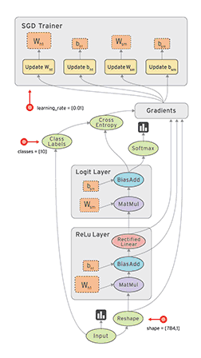

# 2.5 计算图

前两小节对tensor进行了详细介绍，知道了tensor是pytorch的核心数据结构，各类数据均以tensor来表示，并且tensor类中有许多属性与求导/梯度有关，接下来我们将深入学习pytorch的自动求导模块——autograd。在autograd正式开始之前，需要了解一个重要概念——计算图（Computational Graphs）。


在学习自动求导系统之前，需要了解计算图的概念。计算图（Computational Graphs）是一种描述运算的“语言”，它由节点(Node)和边(Edge)构成。

根据[官网](https://pytorch.org/docs/stable/export.ir_spec.html#graph)介绍，节点表示数据和计算操作，边仅表示数据流向

- **Each** **node in this graph represents a particular computation or operation,** and edges of this graph consist of references between nodes.
- **A Node represents a particular computation or operation** and is represented in Python using the torch.fx.Node class. Edges between nodes are represented as direct references to other nodes via the args property of the Node class. 

更多关于计算图、节点和边的概念，可以阅读：

- https://medium.com/tebs-lab/deep-neural-networks-as-computational-graphs-867fcaa56c9
- https://simple-english-machine-learning.readthedocs.io/en/latest/neural-networks/computational-graphs.html
- https://www.cs.cornell.edu/courses/cs5740/2017sp/lectures/04-nn-compgraph.pdf

~~**节点**表示数据，如标量，向量，矩阵，张量等~~

~~**边**表示运算，如加、减、乘、除、卷积、relu等；~~

记录所有节点和边的信息，可以方便地完成自动求导，假设有这么一个计算：

> y = (x+ w) *  (w+1)

将每一步细化为：

> a = x + w
>
> b = w + 1
>
> y = a * b

得到计算图如下：


有了计算图，我们可以尝试进行forward，带入x,w的输入数据，就得到结果y。  

同样的，如果需要获取各参数的导数，也可以方便地获得。 

## 计算图求导

假设我们要算y对w的导数，在计算图中要怎么做呢？

先来看w和y之间的关系，w会通过左边这条路走到y，也会通过右边这条路走到y，因此梯度也是一样的，会经过这两条路反馈回来。

所以y对w的偏导有两条路径，可以写成以下形式， ∂y/∂w = ∂y/∂a* ∂a/∂w + ∂y/∂b* ∂b/∂w，然后可以通过计算图依次求出。

如图所示：


这样我们得到 y对w的导数是5，我们可以拿纸和笔推一下，是否是一样的。

我们发现，所有的偏微分计算所需要用到的数据都是基于w和x的，这里，w和x就称为**<font color=red>叶子结点</font>**。

叶子结点是最基础结点，其数据不是由运算生成的，因此是整个计算图的基石，是不可轻易”修改“的。而最终计算得到的y就是根节点，就像一棵树一样，叶子在上面，根在下面。

## 叶子结点

叶子结点是最基础的结点，其数据不是由运算生成的，因此是整个计算图的基石，是不可轻易”修改“的。而最终计算得到的y就是根节点，就像一棵树一样，叶子在上面，根在下面。


张量有一个属性是is_leaf, 就是用来指示一个张量是否为叶子结点的属性。

我们通过代码，实现以上运算，并查看该计算图的叶子结点和梯度。

```python
import torch

w = torch.tensor([1.], requires_grad=True)
x = torch.tensor([2.], requires_grad=True)

a = torch.add(w, x)
b = torch.add(w, 1)     # retain_grad()
y = torch.mul(a, b)

y.backward()
print(w.grad)

# 查看叶子结点
print("is_leaf:\n", w.is_leaf, x.is_leaf, a.is_leaf, b.is_leaf, y.is_leaf)
# 查看梯度
print("gradient:\n", w.grad, x.grad, a.grad, b.grad, y.grad)
# 查看 grad_fn
print("grad_fn:\n", w.grad_fn, x.grad_fn, a.grad_fn, b.grad_fn, y.grad_fn)
```

> tensor([5.])
> is_leaf:
>  True True False False False
> gradient:
>  tensor([5.]) tensor([2.]) None None None
> grad_fn:
>  None None <AddBackward0 object at 0x000001F9386CC4E0> <AddBackward0 object at 0x000001F9386CC518> <MulBackward0 object at 0x000001F9386C3C18>

我们发现y就不是叶子结点了，因为它是由结点w和结点x通过乘法运算得到的。


补充知识点1：**非叶子结点**在梯度反向传播结束后释放

只有叶子节点的梯度得到保留，中间变量的梯度默认不保留；在pytorch中，非叶子结点的梯度在反向传播结束之后就会被释放掉，如果需要保留的话可以对该结点设置retain_grad()


补充知识点2：**grad_fn**是用来记录创建张量时所用到的运算，在链式求导法则中会使用到。

思考一下y对w求导的过程，我们知道只要记录下计算图中的结点（数据）和边（运算），就可以通过链式法则轻易的求取梯度。

所以在pytorch中，自动微分的关键就是记录数据和该结点的运算。回想一下张量的结构当中其实就记录了这两个重要的东西。

在张量中，数据对应着data，结点的运算对应着grad_fn，大家现在应该明白为什么结点的运算叫grad_fn而不叫fn了吧，因为这个运算是在求梯度的时候使用的。


## 静态图与动态图

以上就是计算图的简单介绍。计算图根据计算图的搭建方式可以划分为静态图和动态图。

**pytorch**是典型的动态图，**TensorFlow**是静态图（TF 2.x 也支持动态图模式）。

动态图和静态图的搭建方式有何不同，如何判断和区分？

第一种判断：这就要看运算，是在计算图搭建之后，还是两者同步进行

先搭建计算图，再运算，这就是静态图机制。

而在运算的同时去搭建计算图，这就是动态图机制。

第二种判断：也可以通过判断**运算过程中**，**计算图是否可变动**来区分静态图与动态图。

在运算过程中，计算图可变动的是动态图；计算图不可变，是静止的，就是静态图。

下面来看两个示意图。




图1为pytorch的动态图示意，图2为TensorFlow的静态图示意。

动态图优点：

1. 易理解：程序按照编写命令的顺序进行执行

2. 灵活性：可依据模型运算结果来决定计算图

静态图优点：

1. 高效性：优化计算图，提高运算效率（但在gpu时代，这一点对于初学者而言可忽略不计）

缺点：

1. 晦涩性：需要学习 seesion, placeholder等概念，调试困难


以上是关于计算图概念的介绍，下一小节将详细剖析autograd机制及其常用的功能函数，请注意，下一节内容也非常丰富，可能需要多次阅读以充分理解。